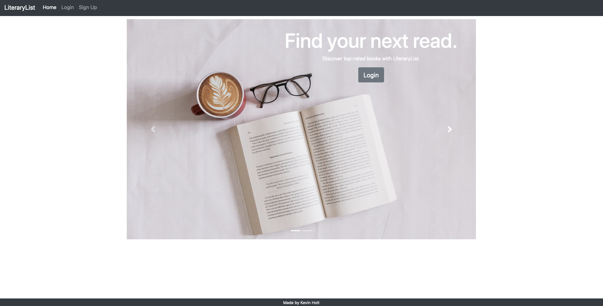
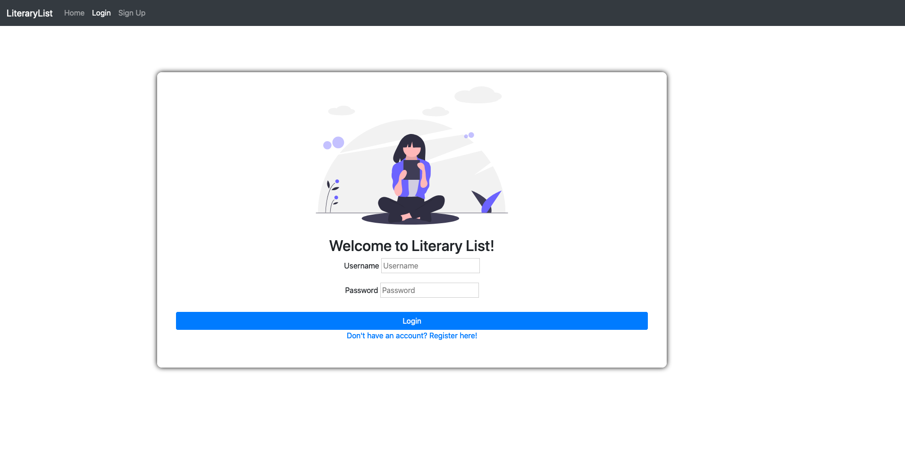
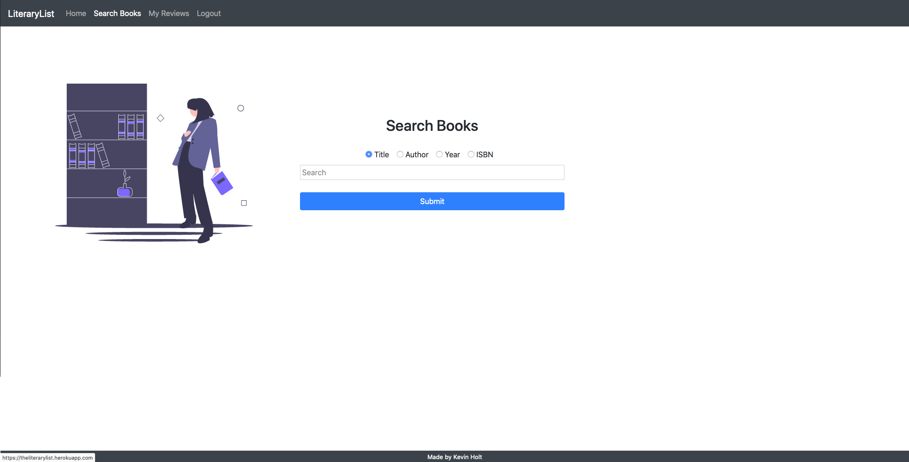
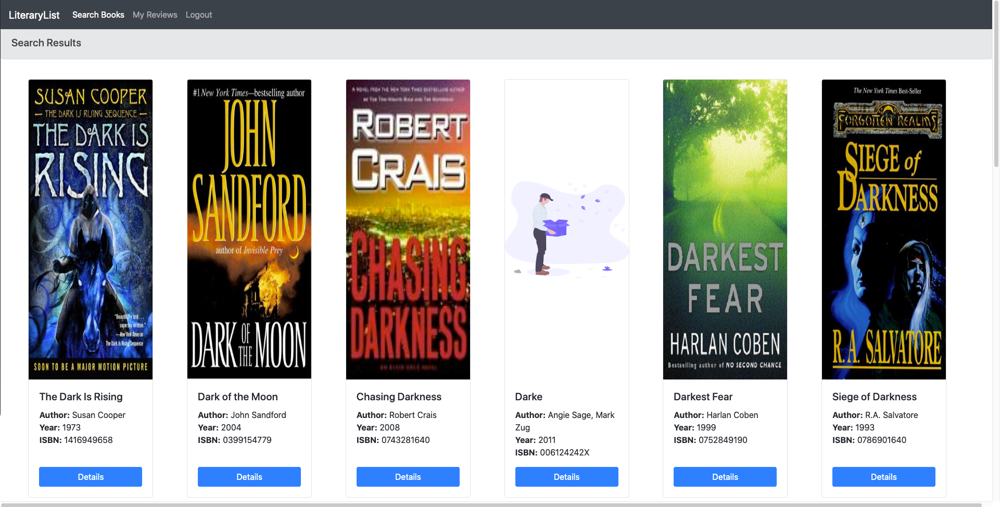
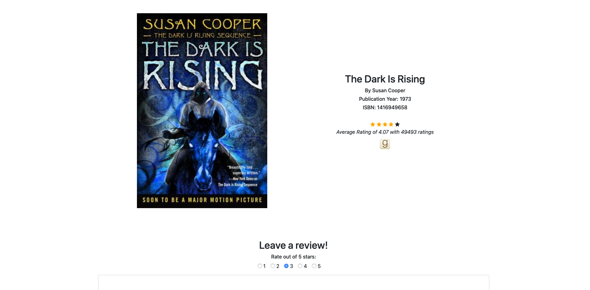
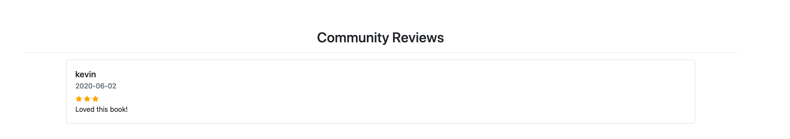

# LiteraryList

LiteraryList is a web application that allows users to search for books and leave reviews for any given book. Flask routes are used to generate a book page for any book within the database, which displays the Goodreads average rating via the Goodreads API, provides the option for the user to write a new review and displays any existing user reviews. The OpenLibrary API is used to find book cover images on the results and book pages using the book's ISBN. The application features a user-login system built from scratch using Flask sessions, allowing users to register and login. The data for searchable books, user reviews and login details are stored in a Postgresql database. The application also features an API that allows users to make a GET request to the "/api/<isbn>" route.

This application was built using Python and Flask with an HTML/CSS frontend.

# View the app on Heroku
https://theliterarylist.herokuapp.com

# Screenshots

The following is the index page of the application, which prompts the user to either login or to register for a new account.

When the user clicks to "login", they are directed to the login screen, where they can enter their credentials to login to their account and initiate a Flask session.

Once logged in, the user is directed to the search page and is only accessible to logged in users. This allows the user to search for books by either title, author, year or ISBN.

The results are displayed as shown below once a user submits a search. For example, the below shows the first row of results when the keyword "dark" is searched for book titles. Each page displays 15 results and the remaining results can be reviewed by pressing the "next page" button at the bottom of the page. 

An example book page is shown below, along with the "Community Reviews" section which displays any existing reviews for a given book.

# API

If a user makes an API call via the "/api/<isbn>" route, where <isbn> represents an ISBN number for a given book, the application will return a JSON response containing the book’s title, author, publication date, ISBN number, review count, and average score.
  
<pre><code>
  {
    "title": "Memory",
    "author": "Doug Lloyd",
    "year": 2015,
    "isbn": "1632168146",
    "review_count": 28,
    "average_score": 5.0
}
</code></pre>
